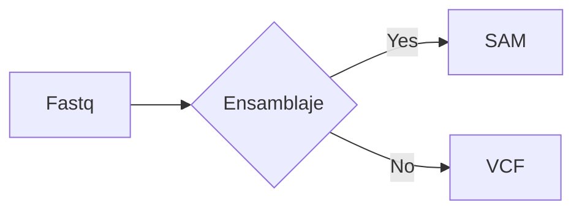

# Manejo de Datos

Los datos en [[1. Fundamentos de Bioinformatica|Bioinfomatica]] pueden ser variados y comprenden la primera parte de cualquier análisis en esta clase vamos a aprender los principales formatos en los cuales vamos a recolectar información relacionada a organismos biológicos.

# Formatos para Meta-datos

Tipo excel, pero en esta clase formatos mas comunes entre diferentes áreas (precursores)
## Formatos con separador

| Nombre  | Edad |
| :------ | ---- |
| Carlos  | 21   |
| Claudio | 22   |
| Avril   | 25   |
### csv (vector separado por comas)
 
```text
Nombre,Edad
Carlos,21
Claudio,22
Avril,25
```

### tsv (vector separado por tab)

```text
Nombre	Edad
Carlos	21
Claudio	22
Avril	25
```


# Formatos de ADN y Proteínas
## Fasta

```fasta
>Nombre
GCAGCTAGCTAGCTAGCTGAGCACTGATCGAC
GTCAGCTAGCTGATGCTGATGCTACGAGCTAC
GCATGCTAGCGAGCTACTGACGAGTCTAGCTA
```

# Formatos de datos NGS
## Fastq

```fastq
@nombre
GTCGATCGTAGCTAGCTGACTGATGCATGCTACGATCTAGCTATAGCTGCTAGCTAGCTAGCT
+
&$&%$&$A$D&A$SD&$AD$&A$D&$A&SD$A&S$DA$D&A$&D$AS$D&ASD&A$S&D
```



*Mas información en [mermaid](https://mermaid.js.org/intro/)*
# Formatos de compresión

Formatos de compresión permite ahorrar espacio `zip` , `gzip` `tar.gz` 

SRA -> sra
# Formatos adicionales 

## Datos anidados

### Json - 

```json
[{ "given" : "John", "surname" : "Smith", "sku" : "20223", "price" : 23.95}, { "given" : "Alice", "surname" : "Brown", "sku" : "54321", "price" : 199.95}, { "given" : "John", "surname" : "Smith", "sku" : "23420", "price" : 104.95}, { "given" : "Bob", "surname" : "Green", "sku" : "90231", "price" : 300.00}, { "given" : "Scott", "surname" : "Jones", "sku" : "54321", "price" : 199.95}, { "given" : "Jim", "surname" : "Lee", "sku" : "89820", "price" : 46.50}]
```

### xml -> NCBI 

```xml 

<?xml version="1.0"?>
<customers>
	<customer id="55000"> 
		<name>Charter Group</name> 
		<address> 
			<street>100 Main</street> 
			<city>Framingham</city> 
			<state>MA</state> 
			<zip>01701</zip>
		</address> 
		<address> 
			<street>720 Prospect</street> 
			<city>Framingham</city> 
			<state>MA</state> 
			<zip>01701</zip> 
		</address> 
		<address> 
			<street>120 Ridge</street> 
			<state>MA</state> 
			<zip>01760</zip> 
		</address> 
	</customer> 
</customers>
```

# Referencias

1. Summary of JSON, JSON Lines, and CSV/TSV tabular formats [Internet]. [citado 16 de agosto de 2025]. Disponible en: [https://www.ncbi.nlm.nih.gov/datasets/docs/v2/reference-docs/file-formats/metadata-files/about-json-and-tabular/](https://www.ncbi.nlm.nih.gov/datasets/docs/v2/reference-docs/file-formats/metadata-files/about-json-and-tabular/)
