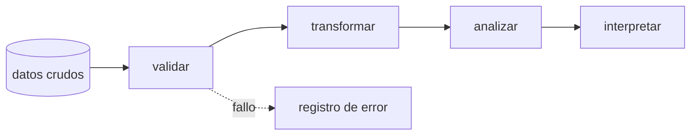

<div class="template-badge">01 · APERTURA CON TENSIÓN</div>
<div class="eyebrow">Pregunta guía</div>

# Dos resultados iguales pueden sostener conclusiones diferentes.

## Sustituye esta afirmación por una tensión concreta de la clase.

<!-- [sin clic] Pedir una predicción. [clic] Revelar el dato que cambia la interpretación. -->

---
layout: section
transition: fade-out
---

<div class="template-badge">02 · SEPARADOR</div>

# Nombre del bloque

Una frase que conecte lo anterior con la siguiente pregunta.

---
layout: theory
---

<div class="template-badge">03 · DEFINICIÓN + CONTRASTE</div>

# Definir para poder decidir

<div class="definition">Definición operativa de dos líneas: qué es, qué permite hacer y bajo qué supuesto.</div>

<div class="grid-2">
  <ConceptCard title="Sí incluye" tag="Alcance">Un ejemplo breve y verificable.</ConceptCard>
  <ConceptCard title="No implica" tag="Límite" tone="amber">Una confusión frecuente que conviene prevenir.</ConceptCard>
</div>

---
layout: visual-right
image: /images/course/cover-dna-helix.webp
credit: Imagen local de ejemplo · reemplazar y citar
sourceUrl: https://www.technologynetworks.com/informatics/articles/an-introduction-to-bioinformatics-bioinformatics-tools-and-applications-406723
---

<div class="template-badge">04 · IMAGEN + LECTURA GUIADA</div>

# Observar antes de explicar

<v-clicks>

- localizar una estructura;
- formular una predicción;
- revelar su significado;
- declarar qué no muestra la figura.

</v-clicks>

---
layout: figure
caption: Pie descriptivo: qué se observa y en qué condiciones
source: Autor · licencia · fuente
sourceUrl: https://commons.wikimedia.org/
---

<div class="template-badge">05 · FIGURA DOMINANTE Y CITADA</div>

<FigureSource
  src="/images/course/chromatogram.png"
  alt="Figura local de demostración"
  caption="Primero observar; después revelar etiquetas."
  credit="Material local · verificar procedencia antes de publicar"
/>

---

<div class="template-badge">06 · CÓDIGO PROGRESIVO</div>

# Construir la solución por etapas

```python {1|3-4|6-7|all}
def resumir(valores):
    """Código y datos ficticios."""
    if not valores:
        raise ValueError("sin datos")

    total = sum(valores)
    return total / len(valores)
```

<p class="muted">Los rangos entre llaves enfocan líneas distintas en cada clic.</p>

---

<div class="template-badge">07 · COMANDO + RESULTADO</div>

# El comando responde una pregunta

<CommandOutput>
  <template #command>

```bash
wc -l muestra.tsv
```

  </template>
  <template #output>

```text
24 muestra.tsv
```

**Interpretación:** hay 24 saltos de línea; aún falta comprobar el encabezado.

  </template>
</CommandOutput>

---

<div class="template-badge">08 · ERROR PRIMERO</div>

# Leer antes de corregir

```text {1|2|3}
programa: cannot open 'muestra.tsv'
No such file or directory
exit status: 1
```

<v-clicks>

1. identificar quién reporta;
2. separar causa y consecuencia;
3. probar una hipótesis sin modificar datos.

</v-clicks>

---
class: compact
---

<div class="template-badge">09 · TABLA COMPARATIVA</div>

# Comparar antes de elegir

| Alternativa | Sirve cuando | Falla cuando |
|---|---|---|
| Método A | condición observable | límite observable |
| Método B | condición observable | límite observable |
| Método C | condición observable | límite observable |

<div v-click class="synthesis">La comparación termina en un criterio de decisión, no en una lista.</div>

---

<div class="template-badge">10 · NÚMEROS + ECUACIÓN</div>

# Una métrica necesita contexto

<div class="grid-3">
  <ConceptCard title="12.4" tag="Centro"><span class="big-number">12.4</span><br>unidad ficticia</ConceptCard>
  <ConceptCard title="3.1" tag="Dispersión" tone="amber"><span class="big-number">3.1</span><br>variación ficticia</ConceptCard>
  <ConceptCard title="48" tag="Muestra" tone="green"><span class="big-number">48</span><br>observaciones</ConceptCard>
</div>

$$\bar{x}=\frac{1}{n}\sum_{i=1}^{n}x_i$$

---

<div class="template-badge">11 · DIAGRAMA MERMAID</div>

# Mostrar dependencias, no decoración



<!-- [pregunta] ¿Qué artefacto verificable sale de cada nodo? -->

---

<div class="template-badge">12 · REVELADO NARRATIVO</div>

# Observar → predecir → revelar

<div class="grid-3">
  <div v-click class="reveal-left"><div class="eyebrow">1 · Observar</div><h2>Dato visible</h2><p class="muted">Describir sin interpretar.</p></div>
  <div v-click class="reveal-up"><div class="eyebrow">2 · Predecir</div><h2>Hipótesis</h2><p class="muted">Anticipar una relación.</p></div>
  <div v-click class="reveal-right"><div class="eyebrow">3 · Revelar</div><h2>Contraste</h2><p class="muted">Mostrar la evidencia decisiva.</p></div>
</div>

---

<div class="template-badge">13 · PIZARRA</div>

# Construir el mecanismo en vivo

<div class="chalk">

**entrada** → transformación → resultado → **decisión**

1. ¿qué se conserva?
2. ¿qué puede fallar?
3. ¿qué evidencia queda?
</div>

<!-- [pizarra] Dibujar una flecha por vez; no revelar el esquema completo al inicio. -->

---
layout: lab
---

<div class="template-badge">14 · LABORATORIO</div>

# Ahora tú

**Pregunta** · una decisión concreta  
**Entrada** · datos pequeños e identificables  
**Restricción** · una condición de seguridad  
**Evidencia** · archivo, figura o argumento verificable  
**Límite** · algo que el resultado no permite afirmar

---
class: compact
---

<div class="template-badge">15 · RÚBRICA / LISTA DE COTEJO</div>

# Qué cuenta como evidencia

| Criterio | Insuficiente | Logrado | Destacado |
|---|---|---|---|
| Corrección | salida inválida | responde la tarea | verifica bordes |
| Trazabilidad | pasos ausentes | pasos repetibles | automatiza y documenta |
| Interpretación | sobreafirma | declara límites | contrasta alternativas |

---
layout: statement
class: glow-bottom
---

<div class="template-badge">16 · SÍNTESIS</div>
<div class="eyebrow">Cierre</div>

# Una conclusión proporcionada a la evidencia.

## Y un límite que permanezca abierto.

---
layout: end
transition: fade-out
---

<div class="template-badge">17 · SALIDA</div>

# Reemplazar por la próxima pregunta

¿Qué evidencia debería recordar el estudiante mañana?
